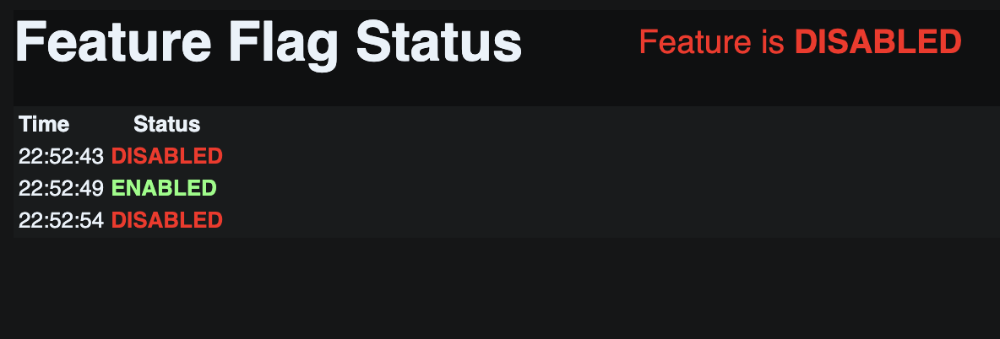

# Flipt + Go HTMX Demo

This repository demonstrates a simple Go web app using HTMX, integrated with Flipt for feature flagging, running locally on Kubernetes via Minikube.



## Prerequisites

- [Docker](https://docs.docker.com/get-docker/)
- [kubectl](https://kubernetes.io/docs/tasks/tools/)
- [minikube](https://minikube.sigs.k8s.io/docs/)
- [helm](https://helm.sh/) (optional, for advanced Flipt install)
- [Go](https://golang.org/) (for local development, not required for containerized usage)

## Setup Instructions

### 1. Start Minikube

```sh
minikube start
```

### 2. Enable Minikube Tunnel (for LoadBalancer services)

In a separate terminal, run:

```sh
minikube tunnel
```

Leave this running while you work.

### 3. Build and Deploy the App

You can use the provided Makefile for all steps:

```sh
make all
```

This will:

- Build the Go app Docker image inside the Minikube Docker environment
- Deploy both the Go app and Flipt to your local Kubernetes cluster

### 4. Access the Apps

- **Flipt Dashboard:** Open [http://localhost:8080](http://localhost:8080) in your browser.
- **Go HTMX App:** Open [http://localhost:8081](http://localhost:8081) in your browser.

> Note: On macOS with Docker, the URLs from `minikube service ... --url` may not work. Use the above localhost URLs instead. If you need to use different ports or troubleshoot, see the Makefile for port-forwarding instructions.

### 5. Configure Feature Flags

You can use the Flipt dashboard UI or the Flipt API via `curl` to create and configure the Boolean feature flag.

#### Option A: Using the Flipt Dashboard (UI)

1. Open the Flipt dashboard (see above).
2. Click **Flags** in the sidebar, then click **Create Flag**.
3. Enter the key `feature_toggle` (must match exactly, case-sensitive).
4. Choose **Boolean** as the flag type and fill in the required fields (name, description, etc.).
5. Enable the flag (toggle ON).
6. (Optional) To do a percentage rollout, go to the **Rollouts** tab for the flag and add a Threshold rollout (e.g., 50% true, 50% false).
7. The flag is now enabled for all users by default.
8. Refresh the Go HTMX app page to see the flag status update.

#### Option B: Using curl (API) — Boolean Flag

To create a Boolean flag named `feature_toggle` via the Flipt API:

```sh
curl -X POST http://localhost:8080/api/v1/namespaces/default/flags \
  -H 'Content-Type: application/json' \
  -d '{
    "key": "feature_toggle",
    "name": "Feature Toggle",
    "description": "Controls whether the demo feature is enabled or disabled",
    "enabled": true,
    "type": "BOOLEAN_FLAG_TYPE"
  }'
```

To enable or disable the flag (update):

```sh
curl -X PUT http://localhost:8080/api/v1/namespaces/default/flags/feature_toggle \
  -H 'Content-Type: application/json' \
  -d '{
    "name": "Feature Toggle",
    "description": "Controls whether the demo feature is enabled or disabled",
    "enabled": true,
    "type": "BOOLEAN_FLAG_TYPE"
  }'
```

> **Note:** No variants or rules are needed for a simple Boolean flag. For advanced targeting, use the Flipt UI to add rollouts or rules.

After running these commands, refresh the Go HTMX app page to see the flag status update.

### 6. (Optional) Add a Color Box Variant Flag

You can use a Flipt variant flag to control the color of the box in the UI. The Go app will use the variant key as a CSS color (e.g., `#ff0000`, `#00ff00`, `#3498db`, etc.).

#### Create the color_box variant flag via API:

```sh
curl -X POST http://localhost:8080/api/v1/namespaces/default/flags \
  -H 'Content-Type: application/json' \
  -d '{
    "key": "color_box",
    "name": "Color Box",
    "description": "Controls the color of the box in the UI",
    "enabled": true,
    "type": "VARIANT_FLAG_TYPE"
  }'
```

Add color variants (e.g., red, green, blue, or hex codes):

```sh
curl -X POST http://localhost:8080/api/v1/namespaces/default/flags/color_box/variants \
  -H 'Content-Type: application/json' \
  -d '{"key": "#ff0000", "name": "Red", "description": "Red box"}'

curl -X POST http://localhost:8080/api/v1/namespaces/default/flags/color_box/variants \
  -H 'Content-Type: application/json' \
  -d '{"key": "#00ff00", "name": "Green", "description": "Green box"}'

curl -X POST http://localhost:8080/api/v1/namespaces/default/flags/color_box/variants \
  -H 'Content-Type: application/json' \
  -d '{"key": "#3498db", "name": "Blue", "description": "Blue box"}'
```

Create a `default` segment (if it does not already exist):

```sh
curl -X POST http://localhost:8080/api/v1/namespaces/default/segments \
  -H 'Content-Type: application/json' \
  -d '{"key": "default", "name": "Default", "description": "Default segment for all users", "matchType": "ALL_MATCH_TYPE"}'
```

Add a rule to serve a color to all users (e.g., blue):

```sh
curl -X POST http://localhost:8080/api/v1/namespaces/default/flags/color_box/rules \
  -H 'Content-Type: application/json' \
  -d '{
    "type": "multi",
    "distributions": [{"variantKey": "#3498db", "rollout": 100}],
    "segmentKeys": ["default"],
    "rank": 1
  }'
```

> **Tip:** You can change the color by updating the rule's `variantKey` to another color value.

After running these commands, refresh the Go HTMX app page to see the color box update.

## App Behavior

- The Go app polls the Flipt API every second and displays the feature status in a live, scrolling log with timestamps.
- The current status is always shown at the top right of the page.
- A new log entry is only added when the status changes.
- If the Flipt API returns a value other than "true" or "false", a warning is shown in the UI.

## Development

To rebuild and redeploy after code changes:

```sh
make redeploy
```

To clean up all resources:

```sh
make clean
```

## Troubleshooting

- If you see `Error: Flipt returned non-OK status: 404`, ensure the flag key matches exactly in Flipt.
- If you see `connect: connection refused`, ensure both pods are running and the tunnel is active.
- If you want to use fixed ports, use `kubectl port-forward` as described in the Makefile.

---

## Makefile Targets

- `make all` - Build, deploy, and set up everything
- `make redeploy` - Rebuild and redeploy the Go app (restarts the deployment to ensure the latest code is running)
- `make clean` - Remove all Kubernetes resources
- `make port-forward` - Port-forward the Go app to localhost:8081
- `make port-forward-flipt` - Port-forward Flipt dashboard to localhost:8080
- `make urls` - Print service URLs
- `make logs` - View Go app logs
- `make help` - Show all Makefile targets

---

## Contributing

Pull requests and issues are welcome! For major changes, please open an issue first to discuss what you would like to change.

## License

This project is licensed under the MIT License. See [LICENSE](LICENSE) for details.
